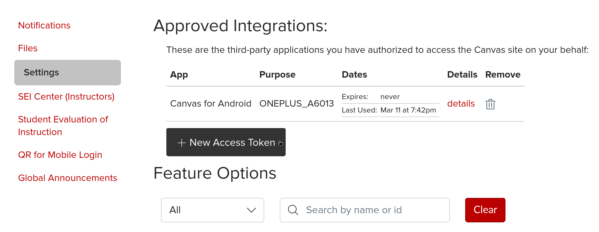
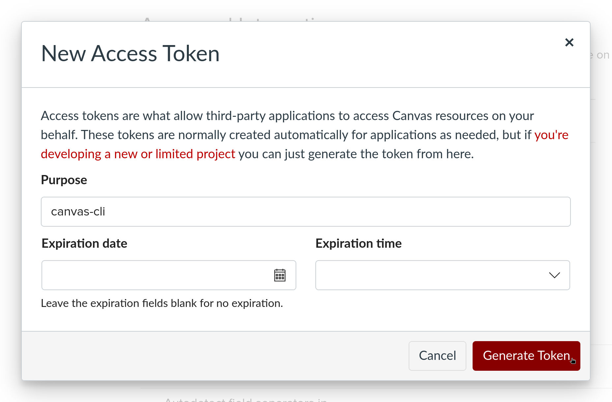
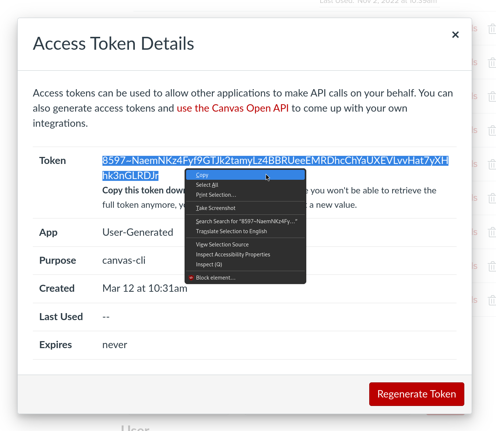
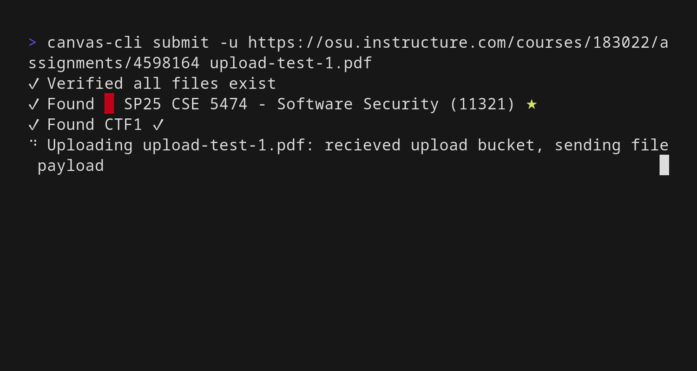
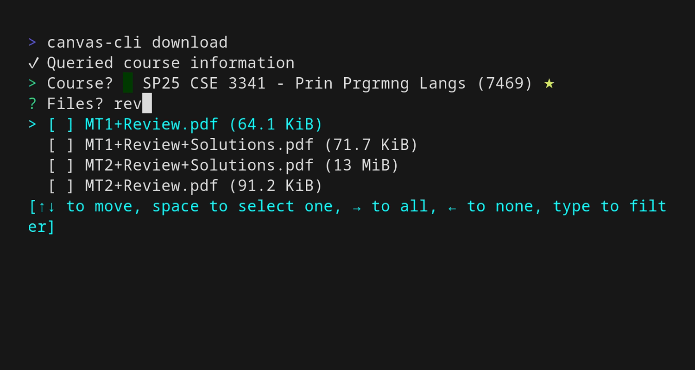

[](https://github.com/mbund/canvas-cli/actions/workflows/build.yaml)


Interact with [Canvas LMS by Instructure](https://instructure.com) from the command line. If your institution hosts Canvas under a `*.instructure.com` domain, it is very likely this will work :rocket:

Features:

- [Submit assignments](#submit-assignments)
- [Download files](#download-files)


## Install

### Crate

```
cargo install canvas-cli
```

### Single Static Binary

Download from the [GitHub Releases](https://github.com/mbund/canvas-cli/releases/latest).

### Nix

As a [Nix](https://nixos.org) flake:

```nix
{
  inputs = {
    canvas-cli.url = "github:mbund/canvas-cli";
  };
}
```

```nix
{
  pkgs,
  canvas-cli,
  ...
}: {
  # home-manager
  home.packages = with pkgs; [
    # ...
    canvas-cli.packages.x86_64-linux.default
  ];

  # nixos
  environment.systemPackages = with pkgs; [
    # ...
    canvas-cli.packages.x86_64-linux.default
  ];
}
```

Or run it directly with `nix run github:mbund/canvas-cli auth`.

## Authenticate

Run `canvas-cli auth` and follow the prompts. In total, you will:

Go to your user profile settings at `https://YOUR_INSTITUTION.instructure.com/profile/settings` or through the UI. Go to **Approved Integrations** and click on **+ New Access Token**.



Then, give your access token a reasonable name like `canvas-cli` and click **Generate Token**. You can leave the **Expiration date** and **Expiration time** blank for it to never expire, or to whatever date you feel is reasonable. Note that access tokens can be revoked at any time you want to later.



Finally, copy this `Token` field and paste it into `canvas-cli auth` when it asks. You can now close out of the dialog.



```
$ canvas-cli auth
> Canvas Instance URL: https://osu.instructure.com
> Access token: ********
✓ Test query successful
Authenticated as:
  Mark Bundschuh (he / him / his)
```

## Submit assignments


Submit interactively, selecting the course and assignment from a dropdown.


Or submit programmatically, specifying the Course ID and Assignment ID as arguments. These IDs are in the URL of the assignment on your Canvas instance.


Or just pass the URL to parse it.



## Download files

Download one or more files from a course. Note that the list is like the **Files** tab on the course page, rather than any linked files under an Assignment.


