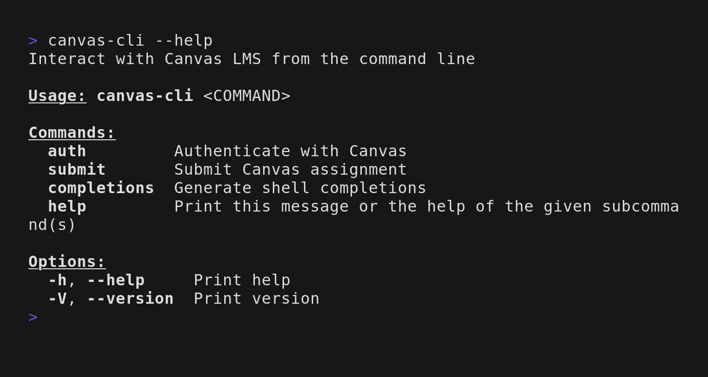
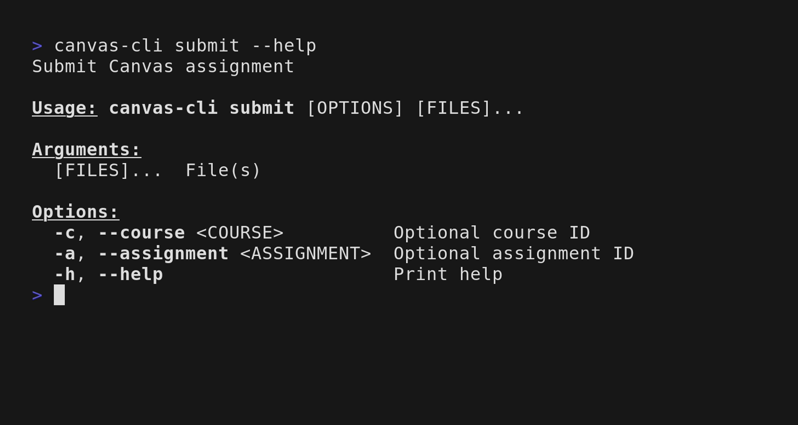
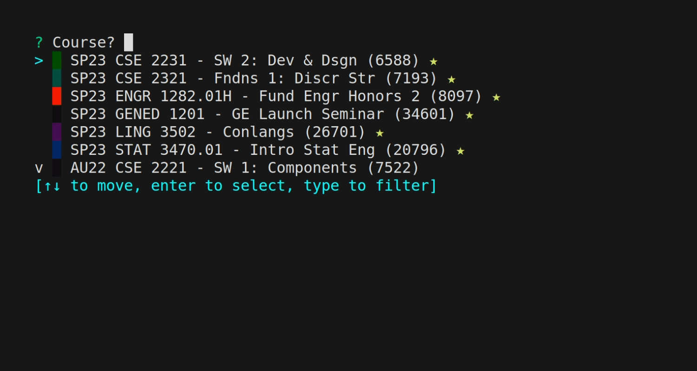

## Submit assignments

## Maintaining

Occasionally, `graphql-client instrospect-schema https://canvas.instructure.com/api/graphql --authorization ... > generated/schema.json` must be run with authorization to update the graphql schema.
